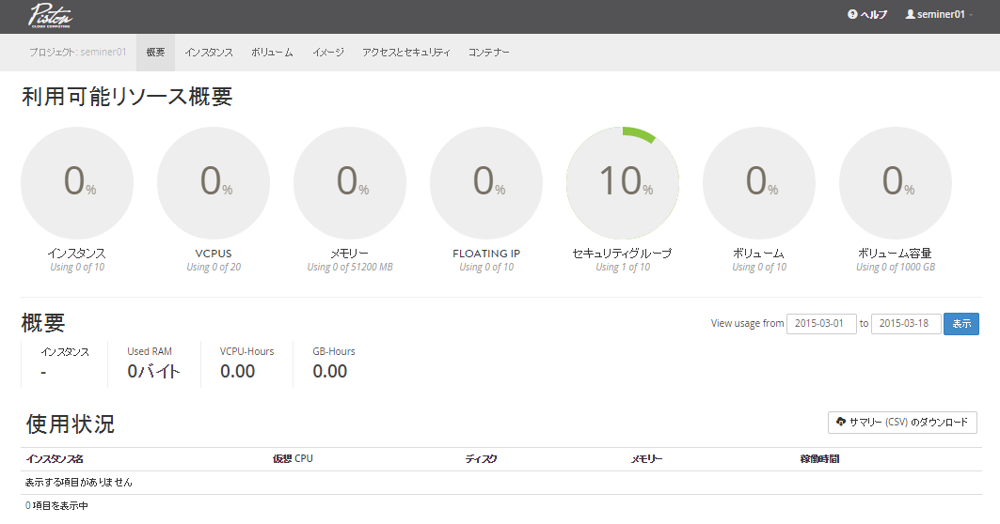
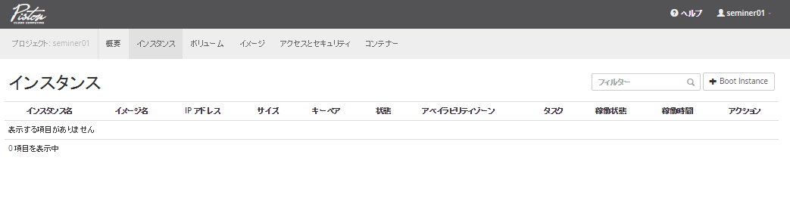
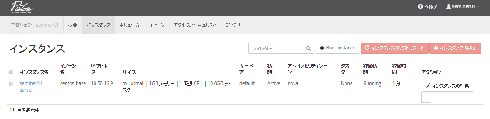

仮想サーバーを1台起動（ダッシュボード）
================

----

概要
================

- ここではOpenStack上にHorizonを利用して仮想サーバーを１台起動します。

----

状態の確認
================

- まず、Horizonへログインし、現在の状況を確認します。
- http://10.50.13.2/
- ログインIDの確認方法は次ページ参照

----

ログインIDの確認
================

- ログインIDを確認するには、以下のコマンドを実行します。

スクリプトの実行::

  ---------ここから---------
  $ check_id
  ---------ここまで---------
  
  注意: 
    パスワードが上、IDが下に表示されます。
    画面の入力欄とは逆になりますのでご注意ください。
----

ログイン後の画面
================

- この画面では全体の概要を確認できます。

----

仮想マシンの起動
================

- 仮想マシンを起動します。
- 「コンピュートの管理」→ 「インスタンス」→「インスタンスの起動」を選択します。

----

仮想マシンの起動
================

- 「詳細」にパラメータを指定します（事項参照）

.. image:: ./_assets/t1-c1/03_instance_02.png
   :width: 45%

----

仮想マシンの起動
================

- 指定パラメータ

  - アベイラビリティゾーン： nova

  - インスタンス名： seminer *XX* -server

    - *XX* の部分は、指定された番号を入力してい下さい。

  - フレーバー： m1.xsmall

  - インスタンス数： 1

  - インスタンスのブートソース： イメージから起動

  - イメージ名： centos-base

  - キーペア、セキュリティグループ：   default

  - ここまでの入力が終了したら、「起動」を選択します。 

----

仮想マシンの起動
================

- この操作で仮想マシンが起動できます。
- リストに表示された仮想マシンのメニューから、「ログの確認」を行い起動状態を確認してみてください。

----

後かたずけ
================

- 起動した仮想マシンを削除します。
- 「コンピュートの管理」→ 「インスタンス」を選択します。
- 起動したインスタンスを選択し、「インスタンスの終了」を選択してください。

  - 「終了」となっていますが、「停止」ではなく「削除」されます。

----

ポイントとまとめ
================

- OpenStackでは仮想マシンを起動する際に、「イメージ」と「フレーバー」を選択します。

  - フレーバーは管理者しか用意することができません。
  - 起動する場合に、詳細なスペックを与えることはできません。これは環境の標準化という側面もあります。

- 起動時には任意の仮想ネットワークへ接続することができます。

- 起動した仮想マシンは即座に削除できます。これはOpenStackが仮想マシンを「一時的なリソース」として取り扱うためです。

  - この考えに即したシステムデザインを行うことで、効率的な運用が可能となります。

