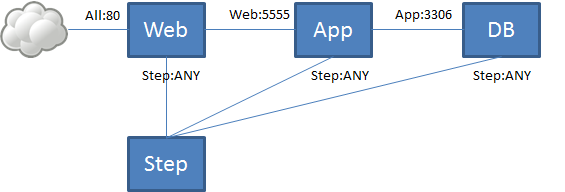

3 階層ウェブシステムの自動構築
==============================

----

概要
================

- ここでは、OpenStack 上への三階層ウェブシステムの自動構築を行います。
- システムは DB サーバー、APP サーバー、WEB サーバー 1 台ずつで構成される簡単なものですが、
  ``userdata`` と ``metadata`` というOpenStackにデータを渡す仕組みを活用して自動インストールと設定を行います。
- 仮想マシン毎に違った起動処理を行う方法を学べます。

----

操作環境の準備
================

- 下記のコマンドで、演習環境の準備を行います。コマンドの実行が完了するまで数分かかります。
- 3階層システムに必要なセキュリティーグループなどを作成しています。
- サンプルファイルがホームディレクトリに用意されます。

**コマンド実行**::

  $ /opt/support/t2-c1/1_init.sh
          <--- ディレクトリー「/opt/support/t2-c1」を使用します。
  ...（中略）... 
  | ID                                   | Name        | Status | Task State | Power State | Networks           |
  +--------------------------------------+-------------+--------+------------+-------------+--------------------+
  | b5440947-e245-4c7c-8d4f-301e5b75f34a | step-server | ACTIVE | -          | Running     | private=10.0.0.1   |
  +--------------------------------------+-------------+--------+------------+-------------+--------------------+
  ============================================================
  Initialization Completed!
  ============================================================

----

userdata による自動インストール (1)
===================================

- 最初に DB サーバーを起動します。
- OpenStack (Nova) には userdata という仕組みがあります。 userdata スクリプトを指定して VM を作成すると、 VM 起動時に自動的に実行されます。
- ここでは、サンプルアプリケーションを git clone し、インストールを行うスクリプトを用意しています。

スクリプトの内容::

  $ cat userdata_dbs.txt 
  #!/bin/bash
  cp /usr/share/zoneinfo/Asia/Tokyo /etc/localtime
  cd /root
  git clone -q https://github.com/josug-book1-materials/sample-app.git
  cd sample-app
  git checkout -b v1.0 remotes/origin/v1.0
  sh /root/sample-app/server-setup/install_db.sh
  echo "### end userdata_dbs"

----

userdata による自動インストール (2)
===================================

- 下記のコマンドを実行し、先ほどのスクリプトを userdata に指定して
  DB サーバーの仮想マシンを起動します。

  - userdata スクリプトが実行され、自動的に DB サーバーのセットアップが行われます。
    起動完了までは少し時間がかかります。

**コマンド実行**::

  $ nova boot --flavor m1.xsmall --image "centos-base" \
      --key-name default --user-data userdata_dbs.txt \
      --security-groups sg-for-step-server,sg-all-from-dbs-net \
      dbs01

----

userdata による自動インストール (3)
===================================

- 下記のコマンドを実行すると、起動中の仮想マシンのコンソールログ（末尾の30行）が 5 秒ごとに表示されます。

  - タイミングにより "ERROR: The resource could not be found." と表示されますが、これは問題ありません。
  - DB サーバーの起動が完了して、コンソールログにログインプロンプトが表示されるまで待ちます。

コマンド実行::

  $ watch -n5 nova console-log --length 10 dbs01

  ...（中略）... 
  CentOS release 6.6 (Final)
  Kernel 2.6.32-504.el6.x86_64 on an x86_64
   
  dbs01 login:

----

metadata を利用した設定 (1)
===========================

- 次は APP サーバーの起動です。今度は metadata を利用して、
  DB サーバーの IP アドレス (``dsb_ip``) を設定します。
  後半がその部分です。詳細は後で確認します。

スクリプトの内容::

  $ cat userdata_app.txt 
  #!/bin/bash
  cp /usr/share/zoneinfo/Asia/Tokyo /etc/localtime
  cd /root
  git clone https://github.com/josug-book1-materials/sample-app.git
  cd sample-app
  git checkout -b v1.0 remotes/origin/v1.0
  sh /root/sample-app/server-setup/install_rest.sh

  yum install -y jq crudini
  DBS_IP=`curl -s http://169.254.169.254/openstack/latest/meta_data.json \
      | jq -r '.["meta"]["dbs_ip"]'`
  crudini --set /root/sample-app/endpoint.conf db-server db_host $DBS_IP
  sh /root/sample-app/server-setup/rest.init.sh start

----

metadata を利用した設定 (2)
===========================

- 下記のコマンドを実行し、APP サーバーを起動します。

  - 先ほどのスクリプトを userdata に指定します。
  - ``--meta`` オプションで DB サーバーの IP アドレスを "``dbs_ip``" という名前で渡します。

コマンド実行::

  $ MY_DBS_IP=`get_instance_ip dbs01 private`
  $ echo $MY_DBS_IP
  10.50.16.8
  $ nova boot --flavor m1.xsmall --image "centos-base" \
      --key-name default --user-data userdata_app.txt \
      --security-groups \
          sg-for-step-server,sg-all-from-app-net \
      --meta dbs_ip=${MY_DBS_IP} \
      app01
  $ wait_instance app01 private
  $ MY_APP_IP=`get_instance_ip app01 private`
  $ nova secgroup-add-rule sg-all-from-dbs-net tcp 3306 3306 $MY_APP_IP/32

----

metadata を利用した設定 (3) 
===================================

- ここでもコンソールログの確認により起動状態を確認します。

  - タイミングにより "ERROR: The resource could not be found." と表示されますが、これは問題ありません。
  - APP サーバーの起動が完了して、コンソールログにログインプロンプトが表示されるまで待ちます。

コマンド実行::

  $ watch -n5 nova console-log --length 10 app01

  ...（中略）...
  CentOS release 6.6 (Final)
  Kernel 2.6.32-504.el6.x86_64 on an x86_64

  app01 login:

----

metadata を利用した設定 (4)
===================================

- APPサーバーの自動起動が成功していれば、5555番ポートでアプリケーションが起動していることが確認できます。
  踏み台サーバーより下記コマンドで確認してみましょう。

コマンド実行::

  $ curl $MY_APP_IP:5555/bbs
  {}                  ← データが無いため空になりますが、正常に応答しています。

----

web サーバーの起動 (1)
======================

- 最後は WEB サーバーの起動です。metadata を利用して、
  今度は APP サーバーの IP アドレス (``app_ip``) を設定します。
  後半がその部分です。

スクリプトの内容::

  $ cat userdata_web.txt 
  #!/bin/bash
  cp /usr/share/zoneinfo/Asia/Tokyo /etc/localtime
  cd /root
  git clone -q https://github.com/josug-book1-materials/sample-app.git
  cd sample-app
  git checkout -b v1.0 remotes/origin/v1.0
  sh /root/sample-app/server-setup/install_web.sh

  yum install -y jq crudini
  APP_IP=`curl -s http://169.254.169.254/openstack/latest/meta_data.json \
      | jq -r '.["meta"]["app_ip"]'`
  crudini --set /root/sample-app/endpoint.conf rest-server rest_host $APP_IP
  sh /root/sample-app/server-setup/web.init.sh start

----

web サーバーの起動 (2)
======================

- 下記のコマンドを実行し、WEB サーバーを起動します。 APP サーバーとほとんど同じです。
- ``--meta`` オプションで APP サーバーの IP アドレスを "``app_ip``" という名前で渡します。

コマンド実行::

  $ echo $MY_APP_IP
  10.50.16.9
  $ nova boot \
      --flavor m1.xsmall --image "centos-base" \
      --key-name default --user-data userdata_web.txt \
      --security-groups sg-for-step-server,sg-web-from-internet \
      --meta app_ip=${MY_APP_IP} \
      web01
  $ wait_instance web01 private
  $ MY_WEB_IP=`get_instance_ip web01 private`
  $ nova secgroup-add-rule sg-all-from-app-net tcp 5555 5555 $MY_WEB_IP/32

----

web サーバーの起動 (3)
===================================

- ここでもコンソールログの確認により起動状態を確認します。

  - タイミングにより "ERROR: The resource could not be found." と表示されますが、これは問題ありません。
  - APP サーバーの起動が完了して、コンソールログにログインプロンプトが表示されるまで待ちます。

コマンド実行::

  $ watch -n5 nova console-log --length 10 web01

  ...（中略）...
  CentOS release 6.6 (Final)
  Kernel 2.6.32-504.el6.x86_64 on an x86_64

  web01 login:

----

アプリケーションの動作確認(1)
==========================

- Web サーバーの起動が完了したら、下記のコマンドで起動を確認します。

コマンド実行::

  $ curl $MY_WEB_IP
  <!doctype html>
  <html>
    <head>
      <meta http-equiv="Content-Type" content="text/html; charset=UTF-8">
      <title></title>
    </head>
    <body>
      <form method="POST" action="/">
        <label for="text">Please write something and hit enter</label> <input id="text" name="text" type="text" value="">
      </form>
       
    </body>
  </html>
----

アプリケーションの動作確認(2)
================

- Webブラウザーから動作確認を行います。

  - Webブラウザーから http://xxx.xxx.xxx.xxx にアクセスすると掲示板アプリが利用できます。

.. image:: ./_assets/t2-c1/02_app.png
   :width: 100%

----

userdata/metadata の裏側
============================================

- これで 3 階層システムの構築は完了です。ここで、userdata/metadata が仮想マシンの中からどのように参照されるかを見てみましょう。
- 踏み台サーバーからWebサーバーへログインします。

コマンド実行::

  $ ssh  root@$MY_WEB_IP
  [root@web01 ~]# 

----

仮想マシン内からの userdata 参照
============================================

- 169.254.169.254 という特別なアドレスにアクセスします。
  起動時に渡した userdata が表示されます。

コマンド実行::

  [root@web01 ~]# 
  [root@web01 ~]# curl -s http://169.254.169.254/openstack/latest/; echo
  meta_data.json
  user_data
  password
  vendor_data.json
  [root@web01 ~]# 
  [root@web01 ~]# curl -s http://169.254.169.254/openstack/latest/user_data
  #!/bin/bash
  ...
  APP_IP=`curl -s http://169.254.169.254/openstack/latest/meta_data.json \
      | jq -r '.["meta"]["app_ip"]'`
  crudini --set /root/sample-app/endpoint.conf rest-server rest_host $APP_IP
  sh /root/sample-app/server-setup/web.init.sh start

----

仮想マシン内からの metadata 参照
================================

- metadata も同じように取得できます。 JSON 形式になっています。

コマンド実行::

  [root@web01 ~]# curl -s \
      http://169.254.169.254/openstack/latest/meta_data.json
  [root@web01 ~]# curl -s \
      http://169.254.169.254/openstack/latest/meta_data.json | jq .
  {
    "name": "web01",
    "public_keys": {
      "default": "ssh-rsa AAAA...."
    },
    "meta": {
      "app_ip": "172.16.10.1"
    },
    ...
  }

----

仮想マシン内からの metadata 参照
================================

- userdata の中では metadata から app_data を取り出して、設定ファイルに設定しています。
  同じことをコマンドでも試してみましょう。

コマンド実行::

  [root@web01 ~]# curl -s \
      http://169.254.169.254/openstack/latest/meta_data.json \
      | jq -r '.["meta"]["app_ip"]'
  172.16.10.1

userdata での参照例::

  APP_IP=`curl -s http://169.254.169.254/openstack/latest/meta_data.json \
      | jq -r '.["meta"]["app_ip"]'`
  crudini --set /root/sample-app/endpoint.conf \
      rest-server rest_host $APP_IP

----

後かたずけ
================

- 起動した仮想マシンをすべて削除します。
- 下記のように、操作用仮想マシンからログアウトして、仮想マシンを削除するスクリプトを実行します。

コマンド実行の様子::

  $ /opt/support/common/9_cleanup.sh
  ### delete all instances
  # delete instance: 43a929db-44ca-4754-a8bb-bd3c1981affa
  # delete instance: 0b602aaf-5a18-4441-9876-c21300e1ff2d
  ...
  ########## completed !!

----

ポイントとまとめ
================

- OpenStack 上への 3 階層ウェブシステムを例に、
  userdata/metadata という OpenStack にデータを渡す仕組みを活用して、
  アプリケーションのインストールと設定を自動化する方法を試しました。
- userdata/metadata を使用すると、仮想マシンの動作を動的に制御できます。
  - 仮想マシン起動時に処理を切り替える
  - 仮想マシン構築時に決まる動的な情報をアプリケーションに渡す、など
- より複雑な設定を行う場合は `Ansible を用いた設定 <./t2-c2.html>`_ と組み合わせるなど、
  いろいろ工夫するとよいでしょう。

----

おつかれさまでした
==================
